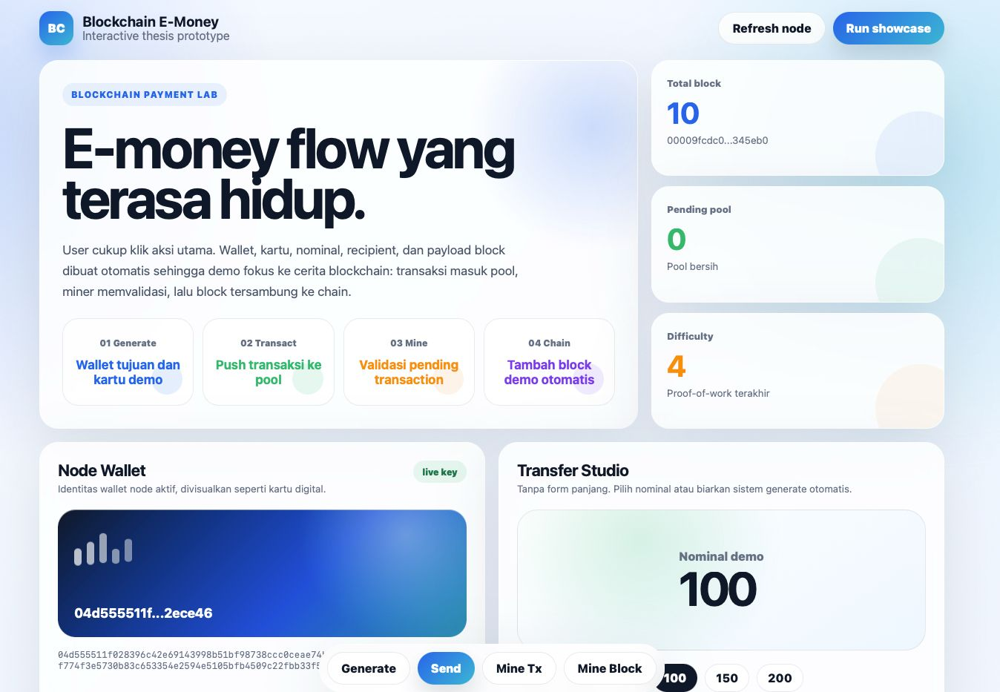

# Blockchain E-Money Thesis Prototype

Prototype platform e-money berbasis blockchain untuk kebutuhan tesis. Project ini berisi backend Node.js/Express untuk blockchain node, P2P server, wallet, transaction pool, miner, dan frontend Vue untuk demo interaktif.

Codebase awal mengacu pada [sf-chain](https://github.com/15Dkatz/sf-chain) oleh David Katz, lalu dikembangkan untuk skenario e-money.

## Tampilan Aplikasi



## Fitur

- Blockchain sederhana dengan genesis block, mining, validasi chain, dan dynamic difficulty.
- Wallet dengan public key, signature, dan balance calculation.
- Transaction pool untuk transaksi pending.
- Miner untuk memasukkan transaksi valid ke block baru.
- P2P WebSocket antar node.
- Frontend Vue interaktif untuk demo transaksi, mining, dan block explorer diagram.
- Script `run-all` untuk menjalankan beberapa node sekaligus.

## Struktur Project

```text
.
├── backend/
│   ├── server.js              # Bootstrap HTTP server dan P2P node
│   └── app/
│       ├── create-app.js      # Express app factory dan static frontend
│       ├── node-context.js    # Inisialisasi blockchain, wallet, pool, p2p, miner
│       ├── routes.js          # API routes
│       ├── miner.js           # Mining transaction pool
│       └── p2p-server.js      # WebSocket P2P server
├── frontend/
│   ├── index.html             # Markup Vue app
│   └── assets/
│       ├── app.js             # State, API calls, dan interaksi UI
│       └── styles.css         # Visual design frontend
├── blockchain/                # Block dan chain logic
├── wallet/                    # Wallet, transaction, transaction pool
├── card/                      # Eksperimen smart-card/APDU
├── screenshot/
│   └── ss.jpeg                # Screenshot aplikasi
├── scripts/
│   └── run-all.js             # Runner multi-node
├── chain-util.js              # Hash, key pair, signature utility
├── config.js                  # Difficulty, mine rate, initial balance
└── package.json
```

## Prasyarat

- Node.js
- npm

Install dependency:

```bash
npm install
```

## Menjalankan Aplikasi

Jalankan satu node:

```bash
npm start
```

Frontend tersedia di:

```text
http://localhost:3001
```

Mode development dengan nodemon:

```bash
npm run dev
```

## Menjalankan Semua Node

Gunakan script ini untuk menjalankan 3 node sekaligus:

```bash
npm run run-all
```

Node yang dijalankan:

```text
node-utama  HTTP 3001  P2P 5001
node-2      HTTP 3002  P2P 5002  peer: ws://localhost:5001
node-3      HTTP 3003  P2P 5003  peer: ws://localhost:5001,ws://localhost:5002
```

UI utama tetap tersedia di:

```text
http://localhost:3001
```

Tekan `Ctrl+C` untuk menghentikan semua node.

## Menjalankan Node Manual

Contoh node pertama:

```bash
HTTP_PORT=3002 P2P_PORT=5002 PEERS=ws://localhost:5001 npm run dev
```

Contoh node kedua:

```bash
HTTP_PORT=3003 P2P_PORT=5003 PEERS=ws://localhost:5001,ws://localhost:5002 npm run dev
```

Contoh node ketiga:

```bash
HTTP_PORT=3004 P2P_PORT=5004 PEERS=ws://localhost:5001,ws://localhost:5002,ws://localhost:5003 npm run dev
```

## API

| Method | Endpoint | Deskripsi |
| --- | --- | --- |
| `GET` | `/blocks` | Mengambil chain node aktif |
| `POST` | `/mine` | Mining block manual dari payload `data` |
| `GET` | `/transactions` | Mengambil transaction pool |
| `POST` | `/transac` | Membuat transaksi baru |
| `GET` | `/mine-transactions` | Mining transaksi valid dari pool |
| `GET` | `/public-key` | Mengambil public key wallet node |

Contoh membuat transaksi:

```bash
curl -X POST http://localhost:3001/transac \
  -H "Content-Type: application/json" \
  -d '{"recipient":"04abc...", "amount":100, "id_kartu":"CARD-001"}'
```

## Testing

Jalankan test Jest:

```bash
npm test
```

Mode watch:

```bash
npm run test:watch
```

## Catatan Developer

- Backend tidak menyimpan state ke database; chain, wallet, dan transaction pool hidup di memory tiap proses node.
- Frontend dilayani sebagai static file dari `frontend/` melalui Express.
- `backend/app/routes.js` hanya menangani HTTP contract.
- `backend/app/node-context.js` menjadi tempat komposisi dependency node.
- `backend/server.js` hanya bertugas melakukan bootstrap proses.
- Hindari menaruh logic blockchain di route handler; letakkan di module domain seperti `blockchain/`, `wallet/`, atau service backend terpisah.